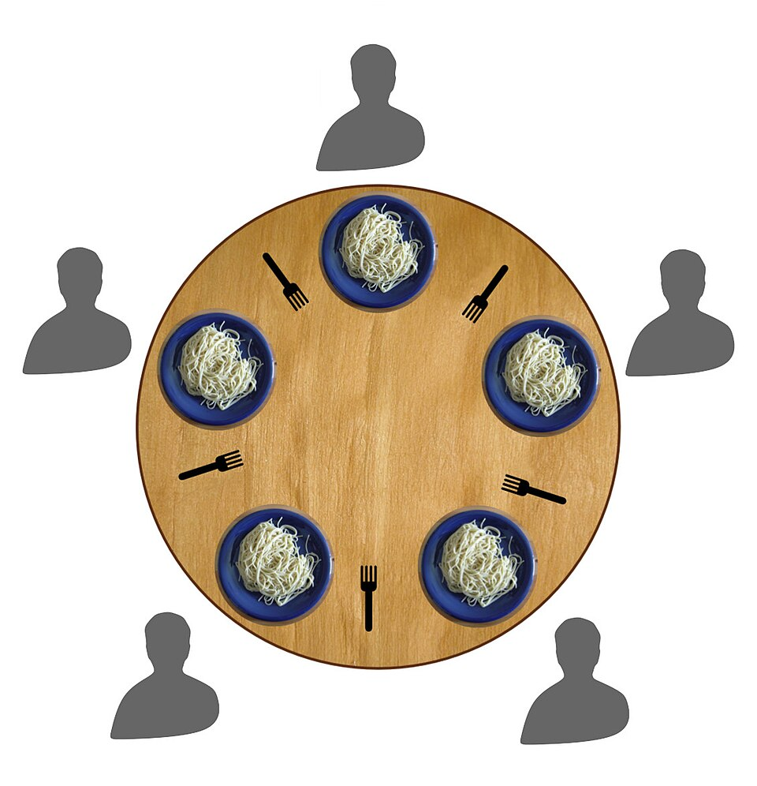
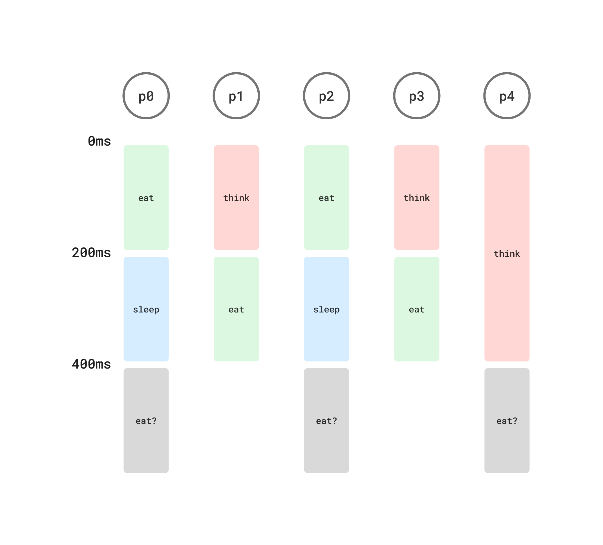

# /philo


[식사하는 철학자 문제](https://namu.wiki/w/%EC%8B%9D%EC%82%AC%ED%95%98%EB%8A%94%20%EC%B2%A0%ED%95%99%EC%9E%90%20%EB%AC%B8%EC%A0%9C)를 해결하는 프로그램

## Quickstart

```
make
./philo 2 410 200 200
```

## Concept



원탁에 철학자들이 앉아서 식사를 합니다.
- 철학자의 수만큼 포크가 있습니다.
- 양 손에 포크를 들어야 식사를 할 수 있습니다.
- 식사를 한 후 잠에 듭니다.
- 일정시간 안에 식사를 시작하지 않으면 철학자는 죽습니다.

이 프로그램은 식사하는 철학자 문제를 스레드, 뮤텍스로 시뮬레이션합니다.
- 철학자의 수만큼 `pthread_mutex_t` 를 생성합니다.
- 각 철학자는 독립적인 스레드에서 철학자의 행동을 모방합니다.

## Requirement

### Requirement 1: Arguments
```
./philo <#_of_philo> <die_ms> <eat_ms> <sleep_ms> [<eat_goal>]
```
- `<#_of_philo>`: 철학자 수만큼 스레드 생성
- `<die_ms>`: 철학자가 식사를 시작하지 못한 이후부터 죽기까지의 시간.
- `<eat_ms>`: 철학자가 식사하는데 걸리는 시간
- `<sleep_ms>`: 철학자가 자는 시간
- `[<eat_goal>]`: 모든 철학자가 이 수만큼 식사를 마치면 프로그램 종료.

### Requirement 2: Log
```
<timestamp_ms> <philo_id> <is thinking | has taken a fork | is eating | is sleeping | has died>
```
- 스레드의 행동을 최대한 빠르게 타임스탬프와 함께 로그.
- 종료 조건을 만족하면 로그 중단.


## Problem

### Problem 1: blocking

과제에서 허용한 `pthread_mutex_lock`는 blocking 함수입니다.
- 철학자가 포크를 잡으려고 정지한 사이 철학자가 죽을 수 있습니다.

해결: `try_lock`을 구현합니다.
```c
// /philo/src/app/seat.c
bool	seat_try_grab(t_seat *s)
{
	bool	ok;

	// 철학자가 1명인 경우 예외처리
	if (s->no_fork)
		return (false);
	ok = false;
	// 테이블 뮤텍스 획득
	mutex_lock(s->mx_ref);
	// 양쪽 포크가 사용가능할 때만 획득
	if (*s->fork1_ref && *s->fork2_ref)
	{
		*s->fork1_ref = false;
		*s->fork2_ref = false;
		ok = true;
	}
	mutex_unlock(s->mx_ref);
	// 포크 뮤텍스 획득 (요구사항을 위한 관례적인 행동)
	if (ok)
	{
		mutex_lock(s->fmx1_ref);
		mutex_lock(s->fmx2_ref);
	}
	return (ok);
}
```
- 모든 포크를 아우르는 하나의 테이블 뮤텍스를 둡니다.
- 철학자는 포크를 직접 잡기 전에 테이블 뮤텍스를 통해 양쪽 포크가 사용가능한 상태인지 먼저 확인합니다.
- 사용가능한 상태가 아니라면 철학자 스스로의 죽음을 확인합니다.
- 포크를 잡거나 철학자가 죽기까지 반복합니다.


### Problem 2: 철학자가 홀수일 때

철학자가 홀수일 때는 효율적인 스케줄링이 필요합니다.



| Time  | Description |
|-------|-------------|
| 0ms   | `n/2`의 철학자가 식사를 합니다. |
| 200ms | 그 옆의 `n/2`의 철학자가 식사를 합니다. |
| 400ms | 0ms에서 식사한 철학자와 나머지 한 명의 철학자가 경쟁합니다. 이 때 나머지 한 명의 철학자가 식사를 하지 못하면 죽는 경우가 존재합니다. |

해결: `sleep` 단계 이후 `usleep()`으로 다음 행동을 지연시킵니다.
```c
// /philo/app/worker_main.c
inline static void	_sleep(t_worker *w_ref, bool *is_end)
{
	t_ms_d	delay;

	while (clock_sleep_for(&w_ref->clk, 1) <= w_ref->phi.end_at)
	{
		if (philo_is_dead(&w_ref->phi))
		{
			*is_end = true;
			break ;
		}
	}
	_worker_update_think(w_ref, is_end);
	// 철학자 수가 홀수인 경우
	if (w_ref->cond.ph_count % 2 == 1)
	{
		// 조건이 허용하는 한 최대한 긴 시간동안 대기합니다.
		delay = w_ref->cond.eat * 2 - w_ref->cond.sleep;
		if (delay > 0)
			clock_sleep_for(&w_ref->clk, delay);
	}
}
```
- 대기하는동안 식사를 못한 나머지 한 명의 철학자가 포크를 획득합니다.


### Problem 3: 종료 전파

종료 조건이 만족된 경우 다른 로그가 출력되지 않아야 합니다.
- 종료 상태를 최대한 빠르게 다른 스레드로 전파해야 합니다.

해결: 모든 스레드가 뮤텍스로 보호된 하나의 객체를 공유합니다.

```c
// /philo/include/app.h
typedef struct s_store
{
	t_mutex		mx;
	t_error		err;
	bool		is_end;
	t_counter	cnt;
}	t_store;
```
- 종료 조건을 만족한 철학자의 스레드는 공유 객체에 종료 상태를 갱신합니다.
- 철학자들은 각 행동 사이에 공유 객체에 접근하여 종료 여부를 확인합니다.
- 공유 객체 뮤텍스를 획득한 상태에서만 로그를 출력합니다.


